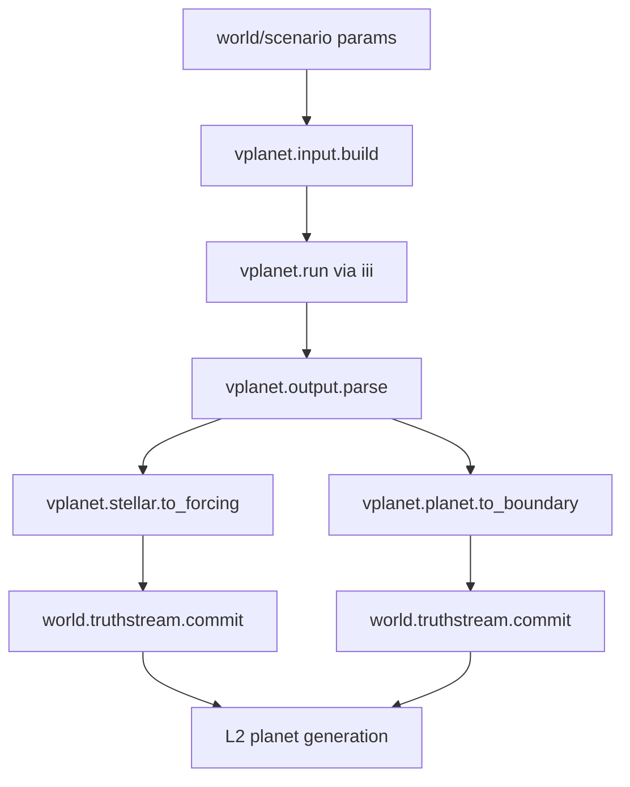
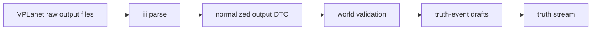

# iii external-tool node graph pattern: VPLanet as first scientific simulator

> **AUDIT (2026-07-06, code-verified):** CURRENT with drift — `ExternalToolResultViewSource` lives under App.NodeGraph contracts (the claimed `App.Ui.ExternalTools` plugin does not exist); the `FANTASIM_SHOW_WORLD_GRAPH` gate is gone. _(See the authority index in `vault/README.md`.)_


**Status:** Architecture note and implementation direction (2026-06-24)

**Scope:** `fantasim-app-godot`, `fantasim-world`, `iii`, and external tool workers such as VPLanet, Blender, and ComfyUI.

**Related:**
- `vault/architecture/iii-world-augmentation-boundary.md`
- `vault/architecture/iii-graph-runtime.md`
- `vault/architecture/node-graph-paradigm.md`
- `vault/architecture/runtime-geodata-import-boundary.md`
- `yokan-projects/fantasim-world/project/contracts/World.TruthStream/TruthStreamIdentity.cs`
- VPLanet repository: <https://github.com/VirtualPlanetaryLaboratory/vplanet>
- VPLanet docs: <https://virtualplanetarylaboratory.github.io/vplanet/>
- VPLanet options and outputs: <https://virtualplanetarylaboratory.github.io/vplanet/help.html>
- VPLanet paper: <https://arxiv.org/abs/1905.06367>

---

## Summary

VPLanet should be brought in through `iii`, not copied directly into `fantasim-world` at first.

The reason is architectural, not only technical:

- VPLanet is an external C/Python scientific simulator with its own input files, output files, modules, examples, and parameter sweep ecosystem.
- `iii` is already the correct external capability axis for tools like Blender and ComfyUI.
- `App.NodeGraph` is already the correct orchestration surface for function-shaped capabilities.
- `fantasim-world` should own accepted DTOs, units, field/truth-stream contracts, and deterministic materializers, not the raw external simulator process.

VPLanet is therefore another iii-backed tool variety:

| Tool | External capability kind | Typical output | Canonical world status |
|---|---|---|---|
| Blender | geometry/render/artifact tool | meshes, images, asset paths | usually artifact, not truth |
| ComfyUI | image generation tool | bitmap artifacts, workflow outputs | usually artifact, not truth |
| VPLanet | scientific evolution simulator | time-series data, logs, system states | candidate world forcing after validation |

The unifying pattern should be:

```text
external tool -> iii worker -> node graph function -> normalized app DTO -> world adapter -> optional truth stream commit
```

Raw external output should never become canonical world state directly.

## Why VPLanet is a good iii candidate

VPLanet describes itself as a planetary system evolution simulator focused on habitability. Its modules cover atmospheric escape, orbital dynamics, rotation, tides, flares, galactic habitability, magma ocean, climate, radiogenic heating, N-body evolution, stellar evolution, and thermal interiors.

Its docs show a CLI/file workflow:

1. create a primary input file such as `vpl.in`;
2. list body files such as `sun.in` and `earth.in`;
3. run `vplanet vpl.in`;
4. read logs and whitespace-separated time-series output files;
5. optionally use support tools such as VSPACE, MultiPlanet, BigPlanet, and vplot.

This is exactly the kind of workflow iii should wrap:

- it has a process boundary;
- it has external dependencies;
- it has text inputs and output artifacts;
- it can be versioned and provenance-recorded;
- it can run as a dev/authoring capability before FantaSim owns the physics.

## Layer fit

VPLanet is not only "planet" data. It spans several FantaSim layers.

| VPLanet module | Likely FantaSim layer | How to use it |
|---|---|---|
| `STELLAR` | L3 stellar | stellar luminosity, XUV, radius, temperature, rotation as forcing |
| `FLARE` | L3 stellar | flare/XUV activity forcing |
| `BINARY` | L3/system dynamics | circumbinary orbital forcing |
| `DistOrb`, `EqTide`, `SpiNBody` | system/orbital bridge around L2/L3 | orbital, tidal, N-body evolution that can affect planet forcing |
| `AtmEsc` | L2 planet atmosphere | atmospheric escape and water/oxygen evolution |
| `MagmOc` | L2 planet/geosphere | magma ocean regime hints |
| `RadHeat`, `ThermInt` | L2 geosphere/interior | radiogenic and interior thermal evolution |
| `POISE` | L2 climate/surface | climate and ice-sheet energy balance |
| `GalHabit` | above L3/system environment | galactic environment forcing |

The strongest first target is L3 stellar forcing:

```text
VPLanet STELLAR / FLARE outputs
-> normalized stellar time-series DTO
-> L3 stellar forcing stream/product
-> L2 planet generation consumes the forcing
```

This keeps VPLanet out of plate tectonics. GPlates `.rot` and shapefile imports remain a separate geodata path for Earth plate reconstruction.

## Node graph integration

The app should expose VPLanet through node graph nodes, but those nodes should not be handwritten one-off UI controls forever. VPLanet is the first scientific simulator case that proves we need a reusable external-tool node metadata pattern.

Recommended VPLanet node family:

| Node function id | Provider | Purpose |
|---|---|---|
| `vplanet.status` | iii | check installed executable/version/modules |
| `vplanet.input.build` | app/world or iii | build primary/body input files from structured params |
| `vplanet.run` | iii | run the simulator in a sandboxed job folder |
| `vplanet.output.parse` | iii or app adapter | parse logs and `.forward`/`.backward` output files into normalized JSON |
| `vplanet.stellar.to_forcing` | world adapter | map stellar outputs into FantaSim L3 stellar forcing DTOs |
| `vplanet.planet.to_boundary` | world adapter | map selected planet outputs into L2 boundary-condition DTOs |
| `world.truthstream.commit` | world | commit validated drafts to the chosen truth stream |

The graph should look like:



The iii provider should support a `vplanet.*` function family the same way it currently supports families such as `comfy.*`, `blender.*`, and `asset.*`.

## Unified external-tool manifest

Blender, ComfyUI, VPLanet, and future tools need one shared way to describe node graph capabilities.

Introduce an external-tool capability manifest. The manifest is not the world model; it is node/UI/runtime metadata.

Suggested shape:

```json
{
  "toolId": "vplanet",
  "toolVersion": "2.5.36",
  "provider": "iii",
  "license": "MIT",
  "functions": [
    {
      "functionId": "vplanet.run",
      "label": "Run VPLanet",
      "category": "external/science",
      "summary": "Runs a VPLanet scenario and returns output artifact references.",
      "inputs": [
        { "portId": "inputBundle", "label": "Input Bundle", "kind": "vplanet/input-bundle", "required": true }
      ],
      "outputs": [
        { "portId": "runResult", "label": "Run Result", "kind": "vplanet/run-result" }
      ],
      "parameters": [
        { "key": "timeoutSeconds", "label": "Timeout", "kind": "int", "default": "300" }
      ],
      "state": {
        "progress": true,
        "logs": true,
        "artifacts": true
      }
    }
  ]
}
```

Required manifest fields:

- `toolId`
- `toolVersion`
- `provider`
- `functionId`
- labels and summaries for app UI
- input and output port ids
- kind hints for wire validation
- parameter names, kinds, defaults, units, and descriptions
- side-effect/expensive flags
- runtime state shape: progress, logs, artifacts, warnings
- provenance fields: executable version, source repo, input files, output files, source data, license

This manifest lets every external tool appear in the app-godot node palette without each tool inventing its own UI metadata channel.

## Node creation: compile-time, runtime, or hybrid

There are three ways to create app node definitions from external-tool capabilities.

### Option A: compile-time generated node catalog

A generator reads stable manifests and emits C# node schemas before build.

Benefits:

- exported app has deterministic node schemas;
- tests can compile against the known catalog;
- UI does not depend on a live iii connection to show core nodes;
- safer for blessed workflows.

Costs:

- changing a node schema requires regeneration and app rebuild;
- local experimental iii tools are not automatically visible.

### Option B: runtime discovery from iii

At startup, app-godot asks iii for available tool manifests and builds palette entries dynamically.

Benefits:

- external tools can be added without app rebuild;
- good for dev labs, agent workflows, and local authoring tools;
- VPLanet modules/options can reflect the installed version.

Costs:

- exported app UI depends on iii availability;
- tests must handle missing/different tools;
- runtime schemas can drift and break saved graphs unless versioned carefully.

### Option C: hybrid, recommended

Use both:

- **blessed nodes** are generated at compile time from pinned manifests;
- **discovered nodes** are loaded at runtime into an "external tools" palette;
- a discovered node can be promoted into the pinned manifest after it proves stable;
- saved graphs record manifest id and version so stale dynamic nodes can show clear compatibility warnings.

This fits current usage:

- Blender and ComfyUI can remain flexible authoring tools;
- VPLanet can start dynamic while we learn its useful outputs;
- once L3 stellar forcing is stable, the VPLanet stellar nodes can become pinned/generated app nodes.

## App-godot display requirements

Node graph UI must show more than input boxes. External scientific tools need visible state, provenance, and data previews.

For every iii-backed tool node, app-godot should be able to show:

### Metadata

- tool name;
- provider: iii;
- installed status;
- tool version;
- function id;
- license;
- source URL;
- runtime requirement summary;
- whether the node is side-effecting or expensive.

### Parameters

- label;
- type/kind;
- unit;
- default;
- allowed values if known;
- help text;
- source module if relevant.

For VPLanet this matters because option names encode type conventions such as boolean/integer/double/string/array, and many options have domain-specific units.

### Inputs and outputs

- port labels;
- kind hints;
- required/optional status;
- compatible downstream adapters.

Examples:

```text
vplanet.run.output -> vplanet/run-result
vplanet.output.parse.output -> vplanet/output-table
vplanet.stellar.to_forcing.output -> world/stellar-forcing-drafts
```

### Runtime state

- queued/running/succeeded/failed/cancelled;
- progress if known;
- stdout/stderr/log excerpt;
- warnings;
- artifact list;
- elapsed time;
- retry/cancel state.

### Data previews

VPLanet outputs should preview as time series, not just raw JSON.

Useful previews:

- output table columns and units;
- time axis;
- selected body;
- selected module;
- quick chart for luminosity/XUV/temperature/radius/rotation;
- final and initial values;
- warnings from log parsing.

Blender and ComfyUI previews are image/asset oriented. VPLanet previews are table/chart oriented. The UI should support both through a common "artifact preview" interface.

### BoomHUD presentation boundary

Use BoomHUD as the app-native presentation contract for external tool outputs.

A2UI remains useful as an architectural reference: external tools should emit declarative UI intent/data, not executable UI code. In `fantasim-app-godot`, that intent should be represented as BoomHUD `RuntimeSurfaceDocument` values with the `boomhud.runtime.basic.v1` catalog, because that is the resident renderer contract already used by app UI bundles.

AG-UI remains a possible later fit for agent/front-end event streams, progress events, and human-in-the-loop interactions. It should not be required for the first external-tool preview path.

The practical boundary is:

```text
iii tool result JSON/artifacts
-> app-side result projector
-> BoomHUD RuntimeSurfaceDocument
-> Godot renderer
```

This projector is presentation-only. It must not write truth streams or become the canonical `fantasim-world` data model. If a result is accepted into world generation, a separate world adapter must still validate units, provenance, identity, and semantic fit.

## Canonical world boundary

VPLanet output can inform world generation, but it must cross a validation/adaptation boundary before becoming canonical.

The adapter must validate:

- source tool and version;
- input file bundle hash;
- output file hash;
- body name mapping;
- time units and direction;
- output column units;
- requested module list;
- missing columns;
- numerical finiteness;
- tick conversion policy;
- stream identity policy;
- provenance metadata.

Only after that should it emit world DTOs or truth-event drafts.



The same rule applies to Blender and ComfyUI:

- generated assets may be useful immediately as artifacts;
- they become world truth only through a world-owned adapter and validation contract.

## Stream identity note

The stream identity naming policy is intentionally not settled in this note.

The current `TruthStreamIdentity` shape is:

```text
VariantId, BranchId, LLevel, Domain, Model
```

and the key format is:

```text
{VariantId}:{BranchId}:L{LLevel}:{Domain}:{Model}
```

For VPLanet integration, node payloads should pass these components explicitly rather than treating a preformatted string as the only input. App UI may display the derived stream key, but world-side code should still receive validated identity components.

The current open naming issue is how far `Domain` should be dot-qualified and what exact semantic rule `Model` should follow. That should be resolved as a separate truth-stream naming decision before committing VPLanet outputs to durable streams.

Until that decision is made, VPLanet node implementation should focus on:

- status;
- input bundle generation;
- iii execution;
- output parsing;
- preview;
- normalized DTO output.

Truth-stream commit can remain a later slice once the naming policy is explicit.

## VPLanet first slice

The first useful implementation slice should not try to expose all VPLanet modules.

Start with one minimal stellar forcing path:

1. `vplanet.status`
2. `vplanet.input.build` for one star and one planet body file shape
3. `vplanet.run`
4. `vplanet.output.parse`
5. app preview of selected stellar output columns

Do not commit truth events in the first slice.

The goal is to prove:

- iii can discover/run VPLanet;
- the node graph can represent the workflow;
- app-godot can display tool metadata and run state;
- output tables can be parsed and previewed;
- normalized DTOs can be passed to downstream nodes.

After that, add a world adapter for L3 stellar forcing.

## Promotion rule: when to recreate VPLanet behavior in fantasim-world

Do not port VPLanet wholesale into `fantasim-world`.

Keep VPLanet external when:

- the physics is exploratory;
- the module has many external assumptions;
- scientists may want the upstream implementation;
- the output is used as forcing or comparison data;
- the dependency is heavy or changes independently.

Promote selected behavior into `fantasim-world` only when:

- the formula is stable and small enough to own;
- it is central to deterministic generation;
- it needs tight integration with fields, reducers, or materializers;
- we have tests and validation cases;
- the world model should own the semantics rather than merely consume an external result.

VPLanet should therefore begin as an iii-backed scientific source and gradually donate selected DTOs, validation rules, and perhaps small formulas into `fantasim-world`.

## Practical recommendation

Build a general iii external-tool node manifest layer, then bring VPLanet in as the first numerical/scientific simulator.

Use this path:

```text
manifest -> node palette -> iii run -> artifact/state preview -> normalized DTO -> optional world adapter
```

This gives one unifying pattern for:

- Blender scripts;
- ComfyUI workflows;
- VPLanet simulations;
- future Python/JS/TS scientific libraries;
- local or remote agent-driven tools.

The app gets a consistent node graph and UI model. iii remains the execution bridge. `fantasim-world` receives only validated, domain-shaped data.

## Implementation status: 2026-06-24

Implemented in `fantasim-app-godot`:

- generic external-tool manifest DTOs in `App.NodeGraph`;
- a pinned VPLanet manifest for `vplanet.status`, `vplanet.input.build`, `vplanet.run`, and `vplanet.output.parse`;
- projection from external-tool manifests into `WorldGenerationNodeSchema`;
- `WorldGenerationNodeCatalog` registration for the VPLanet node types;
- `IiiFunctionProvider` routing for `vplanet.*`;
- default `external.vplanet.earth` graph template with nodes:
  - `vplanet_status`;
  - `vplanet_input`;
  - `vplanet_run`;
  - `vplanet_parse`;
- graph wires:
  - `vplanet_input.inputBundle -> vplanet_run.inputBundle`;
  - `vplanet_run.runResult -> vplanet_parse.runResult`.
- Python iii worker contract slice for VPLanet: implemented in `project/workers/vplanet-worker/` (containing functions `vplanet.status`, `vplanet.input.build`, `vplanet.run`, and `vplanet.output.parse`).
- BoomHUD-native external-tool result presentation first slice: `ExternalToolResultViewSource` in `App.Ui.ExternalTools` projects a VPLanet `outputTable` into a `RuntimeSurfaceDocument` with summary, provenance, and row preview data.

Still intentionally not implemented:

- verified real VPLanet process execution in a production environment; the worker attempts `VPLANET_BIN` when configured, while tests cover the deterministic fallback path;
- artifact persistence, richer chart previews, and graph-run-to-preview wiring;
- conversion from parsed VPLanet output into `fantasim-world` topology, fields, parameters, or truth streams;
- truth-stream stream-id naming for VPLanet-derived products.
