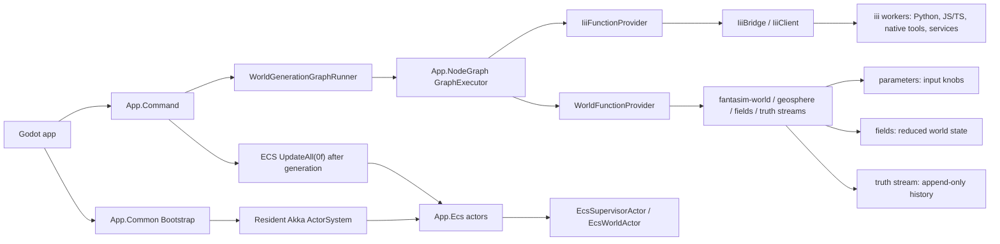
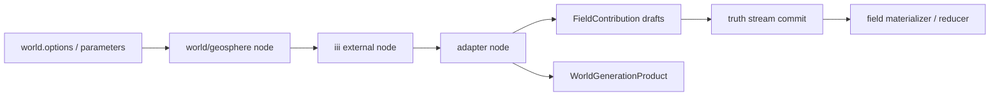

# iii / World augmentation boundary

**Status:** Analysis and recommendation (2026-06-24)

**Scope:** `yokan-projects/fantasim-app-godot` and `yokan-projects/fantasim-world`

**Related:**
- `vault/architecture/node-graph-paradigm.md`
- `vault/architecture/iii-graph-runtime.md`
- `vault/architecture/service-tier-architecture.md`
- `vault/architecture/akka-ecs-integration.md`
- `yokan-projects/fantasim-world/vault/specs/2026-06-19-world-fields-vs-parameters.md`

---

## Summary

`iii` and `fantasim-world` are complementary, not competing layers.

- `iii` is the out-of-process capability axis. It lets the app call external workers, tools, libraries, and services through function ids such as `comfy.*`, `blender.*`, `asset.*`, `test.echo`, and `ping`.
- `fantasim-world` is the deterministic world-domain model. It owns typed parameters, fields, truth streams, materializers, reducers, and domain operators.
- Akka.NET is the resident in-process ownership/lifecycle axis. It owns long-lived concurrent app state such as ECS worlds, actor supervision, and mailbox-serialized access.
- `App.NodeGraph` is the shared execution fabric between them. A graph node is just a `FunctionId` plus JSON params. The executor resolves each node to the first registered `INodeFunctionProvider` that supports that function id.

The important architecture rule: **iii is not the world model and not the graph engine.** It is a provider of external capabilities behind the same graph executor that world-generation functions also use.

## Current code finding

### Shared graph execution

`App.NodeGraph` owns the generic graph model:

- `GraphNode(string Id, string FunctionId, JsonObject Params)`
- `GraphWire(string FromNode, string FromPort, string ToNode, string ToPort, WireKind Kind)`
- `GraphDocument(IReadOnlyList<GraphNode> Nodes, IReadOnlyList<GraphWire> Wires, string SinkNodeId)`
- `GraphExecutor`
- `INodeFunctionProvider`

`GraphExecutor` performs the deterministic topological walk, merges static node params plus wired upstream outputs into a JSON payload, then asks providers who supports the node's `FunctionId`.

That makes a node graph a general app paradigm. It can contain world functions, iii functions, or future function families if their payload contracts line up.

### iii side

`ComposeIii` registers:

- `IiiBridge` as `IIiiInvoker`
- `IiiFunctionProvider` as `INodeFunctionProvider`
- `IiiOrchestrator` and its commands

`IiiFunctionProvider` claims:

- `comfy.*`
- `blender.*`
- `asset.*`
- `test.echo`
- `ping`

It forwards calls to `IIiiInvoker.RequestAsync(functionId, payload)`. The Godot seam implementation is `IiiBridge`, which wraps the gdextension `IiiClient` and speaks to iii over the configured websocket.

### World side in the app

`ComposeWorld` registers:

- `App.World.IService`
- `FieldViewService`
- `WorldFunctionProvider` as `INodeFunctionProvider`

`WorldFunctionProvider` claims:

- `world.*`
- `geosphere.*`
- `crust.*`

The current concrete functions include:

- `world.options`
- `world.body-formation`
- `world.layer-scope`
- `crust.generate`

The command `world.run_generation_graph` pulls all registered `INodeFunctionProvider`s from the registry before constructing `WorldGenerationGraphRunner`. Therefore the runner can see both iii and world providers when both are composed.

### Akka.NET side in the app

`App.Common.Bootstrap` creates one resident `ActorSystem` named `fantasim` and registers it in the kernel registry with tags `akka` and `actor-system`. That actor system is process-lifetime infrastructure, not a collectible bundle object.

`ComposeEcs` consumes the resident actor system and creates `App.Ecs.Services.Service`. That service is a T3 actor adapter: it creates an `EcsSupervisorActor`, and the supervisor creates one `EcsWorldActor` per ECS world. The actor mailbox is the synchronization boundary for each world.

Current concrete flow:

1. `Host._Ready` activates composition.
2. `Bootstrap` creates the resident `ActorSystem`.
3. `ComposeEcs` creates the actor-backed ECS service and initializes the `main` ECS world.
4. `ComposeWorld` registers world services and world node functions.
5. `ComposeCommand` registers `world.run_generation_graph`.
6. `ComposeIii` registers the iii bridge and iii node-function provider.
7. `world.run_generation_graph` executes the graph through all registered providers.
8. After a successful graph run, `PublishWorldGenerationGraphRun` calls `world.RunGenerationAsync(...)`.
9. If generation succeeds, it calls `Ecs.IService.UpdateAll(0f)`.

That last zero-delta ECS update is intentional: generation and iii-triggered recipes update world products/state, then ECS is nudged to pick up the new generation. iii does not directly drive per-frame simulation math.

### How Akka.NET and iii fit together

Akka.NET and iii are peer tools for different failure modes:

| Concern | Best home | Reason |
|---|---|---|
| Long-lived in-process state | Akka actor | Actor owns state, serializes access, supervises lifecycle |
| ECS world ownership | Akka actor | One world actor can own one `ArchWorld` and runner |
| External Python/JS/TS/native capability | iii worker | Dependency stays out-of-process and replaceable |
| Graph-shaped capability orchestration | `App.NodeGraph` | Topological dataflow is domain-neutral |
| Canonical world truth | `fantasim-world` | Deterministic replay, units, fields, truth streams |
| Godot bridge to iii | T4 `IiiBridge` Node | Godot signal/main-thread constraints require a Node-backed seam |

The current architecture does **not** put iii inside Akka. `IiiOrchestrator` is a plain async class with a `GraphExecutor`, and `IiiBridge` is a Godot `Node` seam. That is correct for the current scope: each iii call is already an async external request, and the bridge must stay on the Godot side of the seam.

Use Akka with iii when there is real state or lifecycle to supervise around iii jobs, not merely because the call is asynchronous.

Good future Akka + iii patterns:

- **Job supervisor actor:** an `IiiJobSupervisorActor` owns long-running iii job state, retries, cancellation, timeout policy, and progress events. The actor calls `IIiiInvoker` or dispatches an `App.NodeGraph` run, but callers still use method-based T1 contracts.
- **World generation coordinator actor:** an actor owns a generation run, invokes a graph that may include iii and world nodes, then commits adapted outputs into truth streams and signals ECS.
- **ECS reaction path:** iii produces an external result, an adapter maps it to fields/events/products, `world.RunGenerationAsync(...)` records the result, then the Akka-backed ECS service receives `UpdateAll(0f)` or a more specific future message.
- **Inbound agent command path:** an external agent/iii worker calls app commands; `App.Command` routes to actor-backed services where needed. The worker never receives `IActorRef` or actor messages.

Bad Akka + iii patterns:

- Wrapping every iii function invocation in an actor when no state, supervision, or backpressure is needed.
- Passing `IActorRef`, `Props`, actor messages, or Akka types across T1 contracts or bundle boundaries.
- Moving `IiiBridge` behind an actor. The bridge is a Godot Node because the gdextension signal loop and main-thread handoff require a Node-backed seam.
- Letting raw iii JSON become actor state or world state without an adapter that validates units, versions, provenance, and field/event shape.

### fantasim-world side

`fantasim-world` separates:

- **Parameters:** typed input knobs, e.g. `geosphere.seed-points.count`, `geosphere.seed-points.seed`, `geosphere.plate-seeds.majorPlateCount`.
- **Ports:** point-to-point typed handoffs between operators, e.g. seed points to plate seeds.
- **Fields:** cross-layer world-state values, e.g. `geosphere.elevation-m`, `geosphere.crust-thickness-m`, `geosphere.orogenic-pressure-index`.
- **Truth streams:** append-only event history with deterministic event ids and hash-chain integrity.
- **DTOs:** stable boundary or persistence shapes, not the simulation model itself.

Example parameter flow:

1. `SeedPointOperator` reads `count` and `seed`.
2. It constructs `SeedPointParameters` from generated parameter ids/descriptors.
3. It produces `points`.
4. `PlateSeedClassifierOperator` consumes `points`, reads `majorPlateCount`, and produces `plate_seeds`.

Example field flow:

1. A domain layer writes `FieldContribution`s for a `FieldId`, subject, and tick.
2. The contribution can be encoded as a truth-event payload.
3. `FieldStateMaterializer` replays field-contribution events.
4. `FieldReductionEngine` groups contributions by `(FieldId, SubjectRef, Tick)`.
5. The reducer declared by the field descriptor produces a final `FieldValue`.

This is the core difference:

| Concept | What it answers | Ownership | Shape |
|---|---|---|---|
| Parameter | "How should this operator calculate?" | One caller/default per operator | Small typed scalar config |
| Port | "What typed object flows to the next operator?" | Point-to-point producer/consumer | Concrete runtime object |
| Field | "What is the world's value for this subject at this tick?" | Cross-layer, many contributors | Reducible world state |
| DTO | "How do we move/store this data stably?" | Boundary/persistence layer | JSON/MessagePack/app-safe shape |

## Can iii augment world generation with third-party Python or JS/TS libraries?

Yes. That is one of the strongest reasons to keep iii as a peer capability axis.

The app can define a graph node whose `FunctionId` resolves to an iii worker implemented in Python, JS/TS, Rust, a CLI wrapper, or a web service. The node payload can include:

- authored parameters from the graph UI,
- current world-generation outputs from earlier nodes,
- field descriptors or sampled field values,
- product addresses,
- a stream identity or run identity,
- file/artifact references,
- preview/rendering requests.

The iii worker can return a JSON object with outputs that the next node consumes. If the output must become world state, the boundary should convert it into first-class world concepts: parameters, field contributions, truth-event drafts, product metadata, or importable artifacts.

Practical examples:

- A Python scientific library estimates erosion from elevation, rainfall, and soil assumptions, returning field contributions for `geosphere.erosion-rate-m-per-ma`.
- A JS/TS library computes graph layout or biome classification for preview/prototyping, returning categorical field contributions.
- A Python ML model predicts river candidates from elevation and precipitation fields, returning candidate products plus confidence fields.
- A Blender or geometry library builds visual assets from world products, returning asset paths. That should usually stay an artifact, not become simulation truth.

## The boundary rule

Use iii for augmentation when the capability is external, experimental, heavy, or artifact-oriented.

Promote into `fantasim-world` when the capability becomes part of canonical world truth.

### Good uses for iii

Keep a capability in iii when it is:

- **Exploratory:** useful for trying ideas before freezing contracts.
- **Tool-backed:** depends on Blender, ComfyUI, GIS tools, ML runtimes, native binaries, browser automation, or other toolchains that do not belong in the deterministic core.
- **Artifact-oriented:** produces images, meshes, previews, training assets, editor diagnostics, or visualizations.
- **Non-deterministic or model-versioned:** depends on ML weights, stochastic inference, remote APIs, or frequently changing third-party behavior.
- **High-friction dependency:** would bring Python/Node/native dependency management into `fantasim-world`.
- **Operator advisory:** suggests values but should not silently define canonical world truth.

Examples that can remain iii:

- image generation,
- mesh refinement,
- editor previews,
- exploratory ML classifiers,
- external climate/erosion approximators used for comparison,
- diagnostics,
- one-off import/export transforms,
- authoring assistants.

### Good reasons to promote into fantasim-world

Recreate or port functionality into `fantasim-world` when it is:

- **Canonical:** downstream simulation treats it as ground truth.
- **Determinism-critical:** the same world seed/parameters/events must reproduce identical values.
- **Unit-sensitive:** values need house units, scale profiles, and reducer policies.
- **Cross-layer:** multiple layers consume or contribute to the same value.
- **Persisted:** results belong in truth streams, field materializers, product addresses, or world identity.
- **Testable as domain law:** it should have focused unit tests and domain invariants.
- **Needed offline:** it must run without external services, Python envs, Node installs, GPU models, or network access.
- **Stable enough:** the algorithm and output contract have stopped changing rapidly.

Examples that should move into `fantasim-world` once stable:

- canonical plate classification,
- canonical crust/elevation evolution,
- field reducers,
- field catalogs,
- materializers,
- unit conversion and scale profiles,
- deterministic climate or hydrology kernels that other layers depend on.

## Recommended lifecycle

Do not choose "third-party forever" or "port everything now." Use a staged lifecycle.

### Stage 1: iii experiment

Start with an iii node when the idea is uncertain or the dependency is easiest outside .NET.

Requirements:

- Define the node function id clearly, e.g. `external.erosion.estimate` or `ml.rivers.classify`.
- Treat inputs and outputs as JSON contracts, not implicit blobs.
- Include parameter keys explicitly.
- Return diagnostics and provenance: library name, version, model id, seed, and confidence when relevant.
- Do not write directly into world truth unless the import boundary is explicit.

### Stage 2: app boundary adapter

If the result is useful, add an adapter that maps third-party output into world-shaped data:

- `FieldContribution`s for values that should enter the fields data plane.
- `ITruthEventDraft`s for committed domain events.
- `WorldGenerationProductAddress` for artifacts/products.
- `WorldGenerationGraphProduct` entries for app-visible run products.
- app DTOs for Godot/UI previews.

At this stage, the source can still be iii, but the shape entering the world should be explicit and typed as soon as possible.

### Stage 3: promotion candidate

Promote only after repeated use shows the capability is not just a tool but domain substance.

Promotion checklist:

- The output affects canonical fields or truth streams.
- The algorithm is stable enough to specify.
- Inputs are known parameters, ports, or field values.
- Units and reducer policy are clear.
- Determinism requirements are known.
- Tests can be written without external services.
- Third-party version drift would be dangerous.

### Stage 4: world-native implementation

When promoted, implement the deterministic core in `fantasim-world`:

- Create/extend parameter descriptors.
- Add or reuse field descriptors.
- Implement an `IWorldGenOperator`, reducer, materializer, or domain service.
- Keep DTOs only at boundaries.
- Add tests for identity, units, field reduction, and replay determinism.

The iii worker can remain as:

- a faster prototype path,
- a comparison oracle,
- an authoring assistant,
- a visualization/export tool,
- a compatibility importer.

## Decision matrix

| Question | If yes | If no |
|---|---|---|
| Does this value define canonical world state? | Promote toward `fantasim-world`. | iii is acceptable. |
| Must it replay deterministically from seed/events? | Promote or wrap with strict deterministic contracts. | iii can remain external. |
| Is it mostly a visual/artifact product? | Leave in iii/app assets. | Consider world fields/events if simulation consumes it. |
| Does it require Python/Node/GPU/native tools? | Keep in iii until value justifies a port. | It may fit world-native sooner. |
| Will multiple world layers consume/contribute to it? | Model as fields/truth in `fantasim-world`. | A graph product or preview may be enough. |
| Is the algorithm still changing weekly? | Keep in iii. | Consider promotion. |
| Would version drift change saved worlds? | Promote or pin/version aggressively. | External use is lower risk. |

## Design recommendation

Use iii as an **innovation and integration boundary**, not as the permanent home for core world laws.

The correct default is:

1. Prototype external capabilities through iii.
2. Convert useful outputs into explicit world-shaped records at the boundary.
3. Promote stable, canonical, deterministic behavior into `fantasim-world`.
4. Leave artifact generation, previews, ML exploration, editor assistance, and high-friction external tools in iii.

This keeps `fantasim-world` clean and reproducible while still allowing the app to borrow the wider Python/JS/TS ecosystem when it is useful.

## Concrete architecture pattern for third-party augmentation

Recommended node split:

- External node: calls the third-party library and returns raw-but-versioned JSON.
- Adapter node: validates and maps raw output into world concepts.
- Commit/materialize nodes: append or replay truth-stream state.

Avoid letting external JSON leak through the whole world stack. The boundary adapter is where the external output becomes a `FieldContribution`, event draft, product address, or app DTO.

## Anti-patterns

- Putting Python/Node package assumptions inside `fantasim-world` core assemblies.
- Treating third-party output as canonical truth without provenance, version, or deterministic replay.
- Creating new DTOs as a substitute for domain records.
- Letting graph node params become a second untyped parameter system for core world behavior.
- Returning units as informal strings with no catalog or scale profile when the value will become a field.
- Using iii for a stable deterministic kernel only because it was initially easier.

## Working answer

Yes, iii can be used to augment world generation with third-party Python, JS/TS, native, or service-based capabilities. That should be encouraged for exploration, tools, and artifact pipelines.

But if the output becomes part of the canonical world, especially if it affects fields, truth streams, identity, replay, or cross-layer calculations, it should gradually be recreated or formalized inside `fantasim-world`.

The split is not "third-party vs first-party." The split is:

- **external capability / artifact / experiment:** iii
- **canonical deterministic world law:** `fantasim-world`
