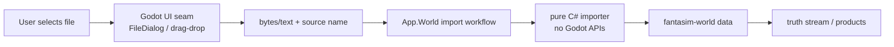
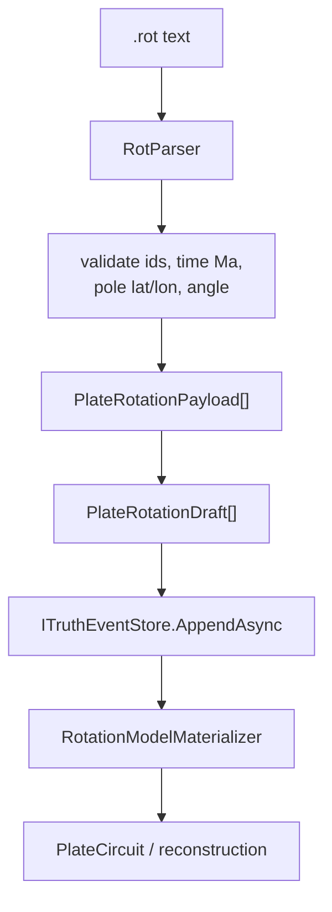
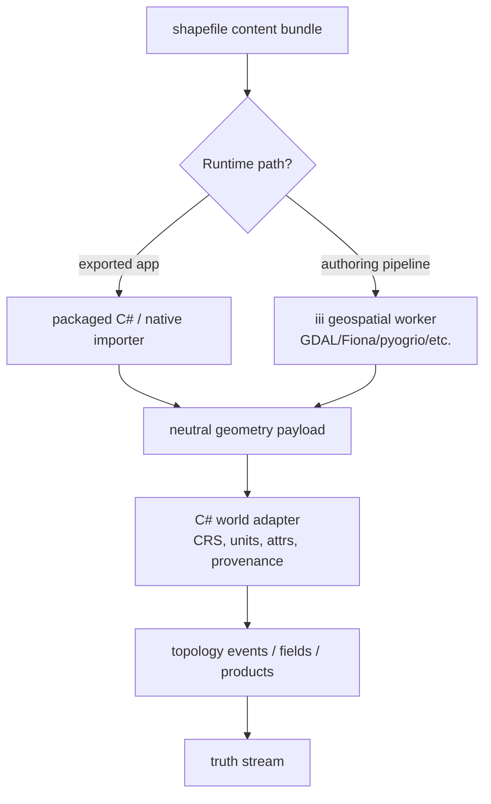

# Runtime geodata import boundary

> **AUDIT (2026-07-06, code-verified):** slices 1–2 landed in fantasim-world under `Geosphere.Plate.Rotation.Stream` (the fallback placement); slices 3–5 (app import seam, shapefile) unbuilt; the bytes-not-paths boundary doctrine remains the live rule. _(See the authority index in `vault/README.md`.)_


**Status:** Architecture note and implementation direction (2026-06-24)

**Scope:** runtime user imports in the exported Godot app, especially GPlates `.rot` files and shapefile bundles.

**Related:**
- `vault/architecture/iii-world-augmentation-boundary.md`
- `vault/architecture/akka-ecs-integration.md`
- `vault/architecture/node-graph-paradigm.md`
- `yokan-projects/fantasim-world/project/plugins/Geosphere.Plate.Rotation.Stream/PlateRotationPayload.cs`
- `yokan-projects/fantasim-world/project/plugins/Geosphere.Plate.Rotation.Stream/PlateRotationDraft.cs`
- `yokan-projects/fantasim-world/project/plugins/Geosphere.Plate.Reconstruction/RotationModelMaterializer.cs`

---

## Decision

For runtime imports from the exported Godot app:

- **GPlates `.rot`: use a C# world-native importer.** The `.rot` row format maps directly onto `PlateRotationPayload`, so importing it is canonical world logic and should be deterministic, testable, and available offline.
- **Shapefile bundles: use a staged strategy.** If shapefile import must run inside the exported app, prefer a packaged C# or native importer plus a C# world adapter. If it is an authoring/dev pipeline, iii is a good first fit because mature geospatial tooling can normalize CRS, geometry, and DBF quirks.
- **Godot app code should do file selection and byte/text loading only.** It should not own the parser or convert geodata into canonical world meaning.
- **Domain/world importers should receive file content, not Godot paths or Godot file APIs.**

The boundary is:

```text
Godot UI/seam: user file access
App.World T3: import workflow, validation orchestration, preview/commit command
fantasim-world: canonical parse/adapt/commit data shapes
iii: optional external geospatial/tooling normalization
Akka: optional supervision for long-running runtime import jobs
```

## Why file content, not file paths

The exported Godot app is the right place to open a user-selected file. It understands `FileDialog`, drag-and-drop, sandbox permissions, platform storage quirks, and Godot `FileAccess`.

But a domain importer should not receive a path and call `Godot.FileAccess` or `System.IO.File` itself. A path is not stable domain input:

- macOS sandbox/security-scoped paths may expire;
- Windows and Linux permissions differ;
- exported app paths may refer to mounted volumes, temporary locations, or user-controlled names;
- tests would need real files instead of simple fixtures;
- `fantasim-world` would learn about UI/runtime filesystem details.

Pass bytes or text instead:

```csharp
public interface IRotImportService
{
    RotImportResult ImportRot(string sourceName, ReadOnlyMemory<byte> content);
}
```

or:

```csharp
public interface IRotParser
{
    IReadOnlyList<PlateRotationPayload> Parse(string sourceName, TextReader reader);
}
```

Then tests can use `StringReader` and inline fixtures. The same importer can run in Godot, CLI tests, future batch tools, and CI.



## `.rot` import

`.rot` should be world-native because it is already a plate-reconstruction domain format.

`PlateRotationPayload` already models a GPlates-style total finite rotation:

- moving plate id,
- fixed/reference plate id,
- time in Ma,
- Euler pole latitude,
- Euler pole longitude,
- rotation angle.

So a `.rot` importer should parse text into `PlateRotationPayload[]`, validate those payloads, optionally convert them to `PlateRotationDraft[]`, and commit them to a truth stream.



### Suggested placement

Preferred world-side packages:

- parser: `fantasim-world/project/plugins/Geosphere.Plate.Rotation.Import/`
- tests: `fantasim-world/project/tests/Geosphere.Plate.Rotation.Import.Tests/`

If a new project is too much for the first slice, place the parser beside the existing stream package, then split later:

- `fantasim-world/project/plugins/Geosphere.Plate.Rotation.Stream/Import/`
- matching tests under `Geosphere.Plate.Rotation.Stream.Tests`

App-side orchestration should be separate:

- request DTOs in `App.World` contract or a future `App.World.Import` contract;
- workflow in `App.World` T3;
- Godot file picker in a seam/UI layer.

### `.rot` parser contract sketch

```csharp
public sealed record RotImportIssue(
    int LineNumber,
    string Code,
    string Message);

public sealed record RotImportResult(
    string SourceName,
    IReadOnlyList<PlateRotationPayload> Rotations,
    IReadOnlyList<RotImportIssue> Issues)
{
    public bool Success => Issues.Count == 0;
}

public interface IRotParser
{
    RotImportResult Parse(string sourceName, TextReader reader);
}
```

Parser requirements:

- deterministic, culture-invariant parsing;
- comments and blank lines ignored according to the chosen supported `.rot` subset;
- strict column validation;
- finite double validation;
- `PoleLatDeg` must be in `[-90, 90]`;
- plate ids must be non-empty;
- every issue should include a source line number;
- no `Godot.*` reference;
- no filesystem access.

### `.rot` commit contract sketch

Keep parsing and committing separate. A user should be able to preview parsed rotations before committing them.

```csharp
public sealed record RotCommitRequest(
    string SourceName,
    IReadOnlyList<PlateRotationPayload> Rotations,
    TruthStreamIdentity Stream);

public sealed record RotCommitResult(
    int RotationCount,
    StreamHead Head);
```

The commit step builds `PlateRotationDraft` values and appends them to `ITruthEventStore`.

## Shapefile import

Shapefile import is much messier than `.rot`.

A shapefile is a bundle, not a single file:

- `.shp`: geometry records;
- `.shx`: index;
- `.dbf`: attribute table;
- `.prj`: coordinate reference system;
- optional sidecars for encoding and metadata.

Runtime import should pass a content bundle:

```csharp
public sealed record ShapefileImportBundle(
    string SourceName,
    ReadOnlyMemory<byte> Shp,
    ReadOnlyMemory<byte>? Shx,
    ReadOnlyMemory<byte>? Dbf,
    ReadOnlyMemory<byte>? Prj);
```

Then normalize into a neutral geometry payload before adapting to world truth:



### Where iii fits for shapefiles

iii is a good fit when:

- the import is an authoring pipeline, not a required offline runtime feature;
- GDAL/Fiona/GeoPandas/pyogrio can save months of parser work;
- CRS transformation or geometry cleaning is required;
- the output is a normalized intermediate payload;
- the exact third-party version can be recorded as provenance.

iii is a weaker fit when:

- the exported app must import files without running a local worker stack;
- the result defines canonical world truth without a C# validation/adapter boundary;
- the import must work offline on every target platform with minimal setup.

Even when iii performs normalization, the final world conversion should be C#:

```text
raw shapefile -> iii normalize -> neutral payload -> C# validate/adapt -> truth/events/fields
```

Do not let raw Python/GDAL JSON leak through the world stack.

## Akka.NET role

Akka is useful when import is not just parsing, but a stateful workflow:

- progress reporting;
- cancellation;
- validation stages;
- timeout/retry policy;
- preview before commit;
- background import while the UI remains responsive;
- coordination between import, world commit, ECS update, and rendering.

Recommended future shape:

```mermaid
sequenceDiagram
  participant UI as Godot UI seam
  participant Cmd as App.Command / App.World import API
  participant Actor as Akka ImportJobActor
  participant Parser as C# importer / iii normalizer
  participant World as fantasim-world
  participant ECS as App.Ecs actors

  UI->>Cmd: Import file content
  Cmd->>Actor: StartImport(sourceName, bytes)
  Actor->>Parser: parse/normalize
  Parser-->>Actor: preview + issues
  Actor-->>UI: progress/preview
  UI->>Actor: Commit
  Actor->>World: build drafts / append truth events
  World-->>Actor: stream head / products
  Actor->>ECS: UpdateAll(0f)
  Actor-->>UI: committed result
```

Do not add Akka just because parsing is asynchronous. Use an actor when import has durable job state, progress, cancellation, supervision, or multiple stages.

## Godot app role

Godot/app code should own:

- file picker or drag/drop interaction;
- reading selected file content;
- detecting multi-file bundles from the user's selection;
- showing parse issues and previews;
- calling app/world import commands;
- asking the user to commit or discard.

Godot/app code should not own:

- `.rot` column semantics;
- GPlates finite-rotation meaning;
- shapefile CRS transformation meaning;
- world field/topology/truth mapping;
- direct truth-stream writes.

## Implementation slices

### Slice 1: `.rot` pure parser

Add a C# parser in `fantasim-world`.

Tests:

- parses a minimal valid `.rot` fixture into `PlateRotationPayload`;
- ignores blank/comment lines;
- reports line-numbered issues for malformed rows;
- rejects non-finite doubles and invalid latitude;
- is culture-invariant.

### Slice 2: `.rot` draft adapter

Convert parsed payloads to `PlateRotationDraft`s for a given `TruthStreamIdentity`.

Tests:

- creates one draft per payload;
- uses stable `PlateRotationDraft.PlateRotationEventType`;
- payload bytes round-trip through `PlateRotationPayloadCodec`;
- tick policy is explicit and tested.

Open decision: draft `CanonicalTick` may be derived from `TimeMa`, import order, or a caller-supplied import tick. Choose deliberately before implementation.

### Slice 3: app import contract

Add an app-facing import request/result DTO that carries source name and bytes/text, not paths.

Tests:

- service accepts content and returns preview issues without committing;
- successful commit updates world generation/products or emits a generation changed event;
- no Godot dependency in the contract or T3 service.

### Slice 4: Godot UI seam

Add file-selection UI or command wiring.

Tests/manual verification:

- exported app can select `.rot`;
- UI displays parse issues;
- commit updates reconstruction preview;
- no domain parser references `Godot.FileAccess`.

### Slice 5: shapefile decision spike

Before implementation, decide runtime requirement:

- If required in exported app: choose a packaged C# or native importer path.
- If authoring/dev only: implement iii normalizer first.

Deliverable should be a neutral payload schema and C# adapter boundary, not direct raw library output.

## Anti-patterns

- Passing Godot file paths into `fantasim-world` and letting domain code open them.
- Referencing `Godot.FileAccess` from importer or domain projects.
- Committing imported data before preview/validation.
- Treating iii-normalized shapefile output as canonical truth without C# validation.
- Adding Akka actors around a single synchronous parse with no job state.
- Putting `.rot` parsing in `app-godot` just because the user selected the file there.

## Practical recommendation

Implement `.rot` first as a world-native C# parser plus adapter. It is small, directly maps to existing `PlateRotationPayload`, and is important for deterministic replay.

Treat shapefile import as a separate spike. Use iii for authoring-time geospatial normalization, but prefer a packaged importer if runtime exported-app shapefile import is a product requirement. In both cases, final conversion into topology, fields, products, or truth streams remains C# world-side.

