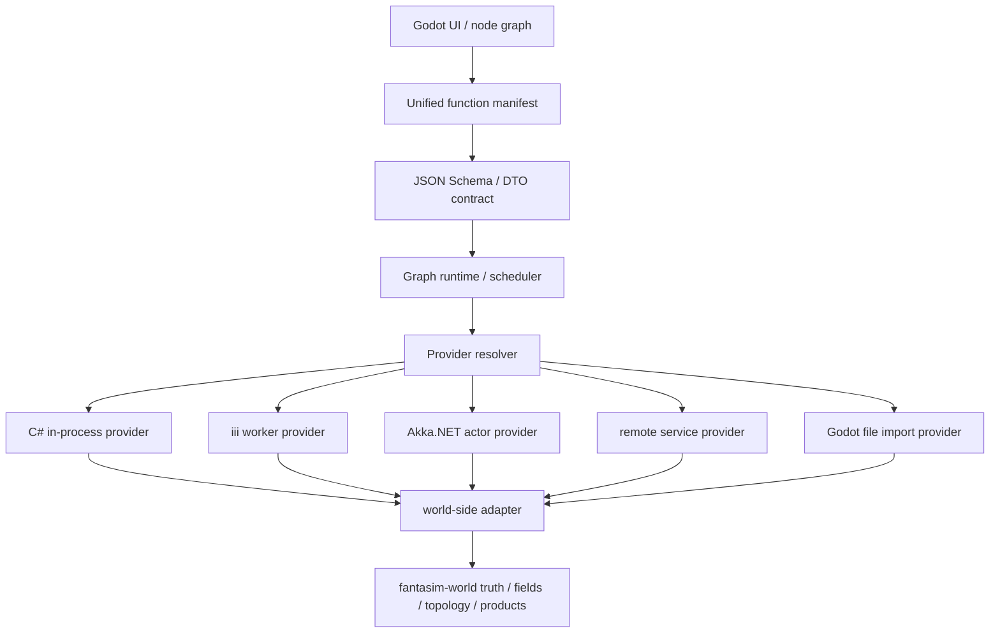
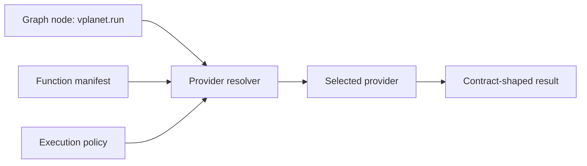
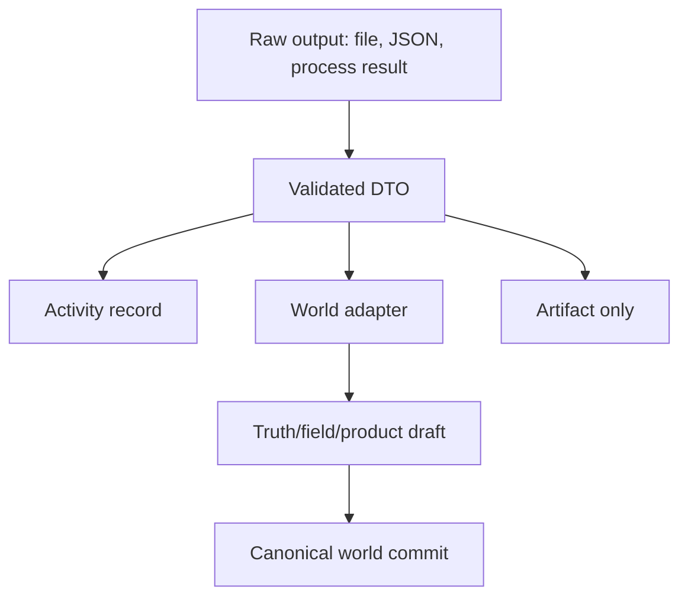

# Unified provider function surface

**Status:** Architecture direction (2026-06-25)

**Scope:** `fantasim-app-godot`, `fantasim-world`, iii workers, Akka.NET backed services, and future external-tool providers.

**Related:**
- `vault/architecture/node-graph-paradigm.md`
- `vault/architecture/iii-graph-runtime.md`
- `vault/architecture/iii-world-augmentation-boundary.md`
- `vault/architecture/iii-external-tool-nodegraph-vplanet.md`
- `vault/architecture/service-tier-architecture.md`
- `vault/architecture/akka-ecs-integration.md`
- `project/contracts/App.NodeGraph/ExternalTools/README.md`

---

## Summary

The app should move toward a unified function and data surface where the node graph, UI, saved graph documents, and world adapters do not branch on whether a capability is "internal" or "external".

The distinction should move down into the provider implementation:

```text
Unified node graph function
  -> provider resolves execution
  -> provider returns contract-shaped data
  -> adapter decides whether the data becomes canonical world state
```

In that model, `internal`, `external`, `iii`, `Akka`, `remote`, and `Godot import` are not different data categories. They are execution strategies behind a common provider contract.

The system still needs to know execution traits such as timeout, side effects, determinism, sandboxing, provenance, and required runtime. But those traits should be provider metadata, not separate node/data families.

## Core rule

Use one common function/data model at the app and node graph level.

Use providers to specialize execution.



The UI sees:

```text
function id
label
category
inputs
outputs
parameters
schema
state shape
provenance shape
```

The provider sees:

```text
how to execute
where to execute
how to serialize
how to validate
how to retry
how to cancel
how to report activity
```

The world domain sees:

```text
accepted world DTOs
field contributions
truth events
topology products
parameter updates
provenance
```

## Why remove the internal/external split from the graph surface

A visible internal/external split makes the graph model grow around implementation accidents:

```text
internal world node
external iii node
Akka node
remote node
import node
```

That forces the UI, saved graphs, validation, and inspection paths to understand execution origin. It also makes future providers harder to add because each new execution path wants a new node class.

The better shape is:

```text
node = function id + params + ports + schema
provider = execution strategy for that function id
```

This keeps the graph stable while providers evolve.

## Provider kind is metadata, not data identity

Provider origin should be visible as metadata for inspection and debugging:

| Field | Purpose |
|---|---|
| `providerKind` | `csharp`, `iii`, `akka`, `remote`, `godot-import`, etc. |
| `providerId` | Stable provider implementation id. |
| `runtimeRequirement` | Binary, Python package, service, actor, or app seam requirement. |
| `determinism` | Deterministic, seeded, versioned, stochastic, or unknown. |
| `sideEffects` | Files, network, process launch, world commit, cache write. |
| `timeoutPolicy` | Default timeout, cancellation support, retry behavior. |
| `provenanceShape` | What activity/truth metadata must be recorded. |
| `trustLevel` | Local trusted, local sandboxed, external service, experimental. |

But the payload should stay contract-shaped:

```text
input payload -> output payload
```

The same payload type should not have a different semantic identity merely because it came from an iii worker instead of a C# method.

## Tier fit

The tier architecture still matters. The unification happens above the execution seam, not by mixing tiers.

| Tier | Role in unified provider model |
|---|---|
| T1 contract | Function manifests, DTO contracts, provider metadata contracts, app-safe records. |
| T2 proxy | Service lookup and forwarding, unchanged. |
| T3 orchestrator | Graph runtime, provider resolver, world adapter, actor adapter if needed. No Godot types. |
| T4 provider/seam | Execution-specific boundary: Godot import, iii bridge, file picker adapter, engine seam. |

Important point: "behavior depends on T4 provider" is right only for engine/tool boundary behavior. Domain behavior should still live in T3 or `fantasim-world`.

Good T4 responsibilities:

- read bytes from Godot-provided file handles or app-safe file inputs;
- call iii through the Godot/Rust bridge;
- invoke Godot-specific import/export APIs;
- marshal main-thread work;
- expose app-safe provider results upward.

Bad T4 responsibilities:

- deciding world truth semantics;
- mutating `fantasim-world` directly;
- storing raw external JSON as canonical state;
- leaking Godot paths, `FileAccess`, `Node`, or actor references into contracts.

## Provider resolution

`App.NodeGraph` should resolve function ids through registered providers. The registry can support one or more provider entries per function id.



Selection can be simple at first:

```text
exact function id match
highest provider priority
provider health is available
schema version is compatible
```

Later selection can add:

```text
offline mode
deterministic-only mode
trusted-only mode
GPU available
licensed tool available
remote fallback allowed
```

## Execution traits should stay explicit

Unifying the graph surface does not mean treating every provider as equally safe.

The runtime still needs execution metadata so it can schedule correctly:

| Trait | Why it matters |
|---|---|
| `isExpensive` | UI warning, scheduling, progress display. |
| `isSideEffecting` | Activity/provenance, undo model, dry-run limits. |
| `requiresExternalProcess` | export packaging and availability checks. |
| `requiresNetwork` | offline behavior and trust settings. |
| `requiresMainThread` | Godot seam scheduling. |
| `isDeterministic` | replay and truth-stream eligibility. |
| `cacheKeyShape` | result reuse. |
| `artifactShape` | file/product display. |
| `commitEligibility` | whether output can become world truth. |

Those traits should be part of the manifest/provider metadata, not separate node classes.

## Data lifecycle

Unified data does not mean every result is automatically canonical.

Use this lifecycle:

```text
raw provider output
  -> validated contract DTO
  -> app result/activity record
  -> optional world adapter
  -> field contribution / truth event / product
```



The adapter is the gate. A VPlanet table, shapefile geometry, or Blender mesh is not world truth just because the node graph has data. It becomes world truth only after a world-side adapter maps it into approved `fantasim-world` concepts.

## Examples

### VPlanet

From the graph surface:

```text
vplanet.input.build
vplanet.run
vplanet.output.parse
vplanet.stellar.to_forcing
```

The graph does not need a special "external VPlanet node". It needs functions with schemas and provider metadata.

Provider execution:

```text
vplanet.run -> iii provider -> Python worker -> VPlanet binary -> run result DTO
```

World acceptance:

```text
VplanetOutputTable
  -> stellar forcing adapter
  -> L3 stellar forcing product or truth event
```

### GPlates `.rot`

For exported Godot app import:

```text
rot.import
  -> Godot import provider receives selected file bytes/content
  -> pure C# parser/importer
  -> plate rotation DTOs
  -> geosphere mobile-plate regime adapter
```

The domain parser should not depend on `Godot.FileAccess` or UI file paths. T4 gathers the bytes/content; pure C# parses them.

### Shapefile

Shapefile can use either:

```text
shapefile.import
  -> iii provider with mature Python GIS libraries
```

or:

```text
shapefile.import
  -> C# provider/parser
```

The graph and downstream adapter should not care. Both return the same validated geometry/topology DTO shape. CRS and geometry complexity can remain in an iii provider until a stable subset deserves a native C# implementation.

### Akka.NET

Akka should be a provider strategy when there is actor-shaped state:

```text
world.generation.run
  -> Akka provider
  -> generation coordinator actor
  -> graph execution and world commit
```

Do not expose `IActorRef`, `Props`, actor messages, or Akka types in the graph contract. The provider can use actors internally.

## Naming recommendation

Prefer names that describe the unified concept:

```text
FunctionManifest
FunctionProvider
ProviderKind
ProviderRuntime
ProviderExecutionPolicy
FunctionSchema
FunctionResult
ActivityProvenance
WorldAdapter
```

Avoid names that bake in implementation origin at the graph level:

```text
ExternalNode
InternalNode
IiiNode
AkkaNode
RemoteNode
```

It is still reasonable to keep folders such as `ExternalTools` while the project is migrating, but the longer-term concept should be "provider-backed functions", not "external nodes".

## Migration path

Do this gradually.

1. Keep current `ExternalTools` schemas for VPlanet as the concrete first case.
2. Introduce or refine a unified `FunctionManifest` shape that can represent both world-native and iii-backed functions.
3. Add provider metadata to manifests instead of hard-coding external/internal categories.
4. Keep generated DTOs schema-first and disposable.
5. Add UI inspector support around function metadata, provider health, payload preview, activity, and artifacts.
6. Move world acceptance into explicit adapters.
7. Promote stable external functions into world-native providers only when determinism, unit policy, and truth semantics are clear.

## Decision

Adopt a unified function/data surface.

Do not make the UI, graph document model, or DTO identity branch on internal vs external.

Do keep provider execution traits explicit and visible.

Do keep canonical world acceptance behind world-side adapters.

This lets FantaSim use Python, JS/TS, C#, Akka.NET, iii, Godot import seams, and future remote services through one graph vocabulary without pretending they have the same runtime risk profile.

## Implementation Note (2026-06-25)

The Godot node graph UI / inspector display slice has been implemented:
- `NodeItem` in `NodeGraphViewModel` was extended with `ProviderMetadata` and `ExecutionTraits`.
- `NodeGraphViewSource` dynamically queries the `WorldGenerationNodeCatalog` (using reflection to remain domain-neutral) to retrieve metadata/traits for each node type.
- `GraphNodeVisualEnhancer` reads these properties via reflection and renders concise facts using a testable helper, appending provider details directly into the detail label's body.
