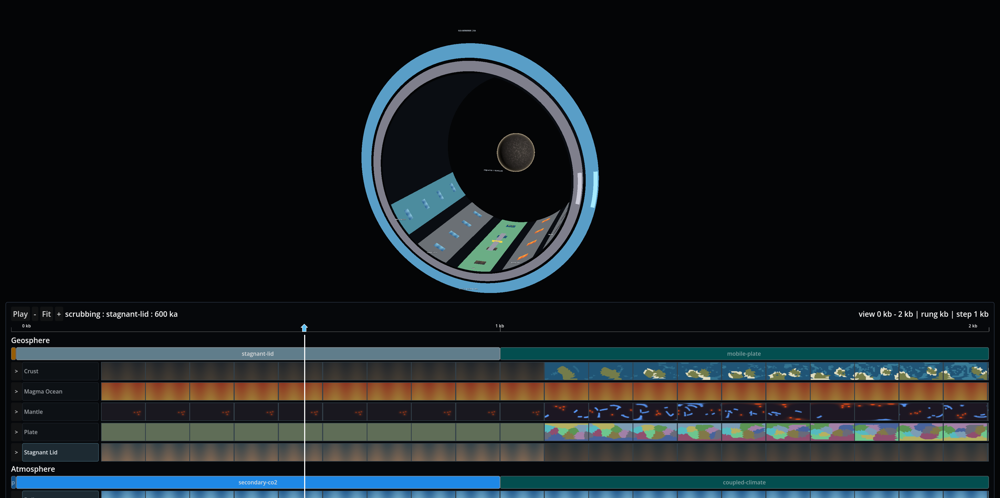

# Rotating tunnel two-ring prototype evidence

**Result:** PASS

**Date:** 2026-07-12

**Approved design:** [../../2026-07-12-rotating-tunnel-two-ring-prototype-design.md](../../2026-07-12-rotating-tunnel-two-ring-prototype-design.md)

**Implementation plan:** [../../../plans/2026-07-12-rotating-tunnel-two-ring-prototype-plan.md](../../../plans/2026-07-12-rotating-tunnel-two-ring-prototype-plan.md)

The implementation was delegated through OpenCode using the exact model id
`zai-coding-plan/glm-5.2`, then independently reviewed, corrected, rebuilt, and exercised in the
exported macOS app with real OS mouse input.

## Code and deterministic gates

The implementation sequence after the approved plan is:

```text
119e6c1 feat(timeline): map tunnel outer dial to canonical kb
0e6b332 feat(timeline): define oblique tunnel ray hits
4775706 feat(timeline): define tunnel focused track carousel
6318d8c feat(timeline): resolve tunnel track activity by regime
52ee21d feat(timeline): coordinate tunnel ring and wall gestures
cb4274b feat(camera): expose atomic globe orbit proof
4c7f55b fix(camera): compile atomic orbit transform snapshot
221ae4e fix(timeline): harden tunnel edge mappings
95497c7 feat(presentation): render tunnel as focused 3d cylinder
772abba fix(timeline): close tunnel numeric edge cases
aab6828 fix(camera): stabilize tunnel evidence diagnostics
a4376db fix(presentation): harden rotating tunnel runtime
0a6513a fix(presentation): expose oblique tunnel depth
dfbc2db fix(presentation): enlarge tunnel evidence framing
```

Final commands and outcomes:

- `task test` — **1,293 passed, 0 failed** across 18 test projects. This includes exact
  `+360° = +100,000,000 ticks (+1 kb)` and `-360° = -100,000,000 ticks (-1 kb)` mapping tests.
- `task bundle:stagetool:test` — **23/23 passed** and `--check-dual` reported no dual copies.
- `dotnet test project/tests/App.Presentation.Tests/App.Presentation.Tests.csproj --no-restore`
  — **76/76 passed**, including the exported-window framing regression.
- `task build:godot:desktop` — final exported desktop target succeeded.
- `task bundles` / `task bundle:install` — all bundle PCKs rebuilt and installed into the export.

## Visual judgment



The fresh 3,840×1,914 export visibly reads as the inside of a cylinder: the elliptical mouth, shifted
smaller throat, longitudinal curved wall sectors, and real globe are spatially separated. Exactly
two physical rings are present. Five unique corridors are visible, and the green bottom-center
corridor is unobstructed above the real Timeline HUD.

The final dedicated tunnel-camera tuning is:

```text
FOV:      60°
position: (12, 8, 32)
target:   (0, -9, -8)
```

This is 27.48° off-axis. The projection regression measures a 0.950 mouth aspect ratio, a mouth
bottom at normalized Y 0.588 (above the HUD), and 0.0724 normalized mouth-to-throat separation. The
constants were tuned because the first exported result was only 9.03° off-axis and extended behind
the HUD, making the shell look like nested disks.

## Real-mouse gestures

Computer Use operated the live `complete-app` window at 1,491×768. Its Timeline panel begins near
Y=476. Every accepted drag below ends at Y=509 or Y=527, inside that existing HUD control, proving
that the strong owned motion/release path survives GUI crossing.

| Gesture | OS drag `(start → end)` | Observed result |
|---|---|---|
| Cylinder wall | `(699,156) → (1050,527)` | `focus 0 → 4`, `stepDelta=4`, snapped `+120°` |
| Outer ring | `(882,308) → (899,509)` | one `ScrubCommit`, `60,000,000 → 72,480,598` |
| Inner ring | `(862,306) → (899,509)` | focused `geosphere.stagnant-lid`, rung `ka`, view-only preview |

The initial focused descriptor was `geosphere.crust`. The wall gesture moved
`geosphere.stagnant-lid` into the bottom focus slot. Runtime production descriptors remain honestly
homogeneous at rung `ka`; no demonstration rung metadata was fabricated.

Outer mapping from the actual log:

```text
angle                 = +44.93015423815734°
kb.UnitTicks          = 100,000,000
raw delta             = 44.93015423815734 / 360 × 100,000,000
                      = 12,480,598.39948815
AwayFromZero delta    = 12,480,598
press tick            = 60,000,000
committed target      = 72,480,598 (unclamped)
commit count          = 1
```

Inner preview from the actual log:

```text
owner                 = geosphere.stagnant-lid
rung / active         = ka / true
angle                 = +45.11128591734666°
raw presentation      = +12,530.912754818519 canonical ticks
fine cursor Z         = -7 → -7.3132728188704625
authoritative tick    = 72,480,598 at press, motion, and release
mutated               = false
```

The before/after images are [inner-before.png](inner-before.png) and
[inner-after.png](inner-after.png). The focused axial cursor and signed readout move while the
shared world tick does not.

## Globe-orbit isolation

For wall, outer, and inner gestures, `camera.debug` was captured before the press, immediately after
release over the HUD, and after follow-up pointer travel to a black background. The Computer Use
click primitive first moves the pointer with no button held, then performs a stationary inert click;
this exposes any stale drag before the click without introducing a motion while pressed.

All nine normalized pose records are byte-identical and have SHA-256:

```text
8df879df85632815edf167c8ed32be34e02ec7f0973af1af2d6840cb45e16ad0
```

The compared subset includes camera/pcam identity and transforms, follow target, yaw, pitch,
distance, spring length, `dragMotionsApplied`, and `draggingNow`. The stable values are yaw `35°`,
pitch `-25°`, distance/spring `4`, `dragMotionsApplied=0`, and `draggingNow=false`. The rig, active
pcam, orbit controls, host binding, and camera-tree flags were all present/true.

See [camera-pose-sha256.txt](camera-pose-sha256.txt) and the `*-pose.json` files in this directory.

## Live world-bundle reload

The same accepted exported process reloaded `world` while the tunnel was enabled. Required lines in
[world-reload-segment.log](world-reload-segment.log) are:

```text
24: Bundle unloaded: world
42: Bundle loaded: world .../bundles/world.pck
50: resource.reload_bundle: reloaded 'world'.
58: Hot-reload: old ALC collected for bundle world
```

There is no `old ALC still pinned for bundle world` line. The new binder was re-enabled and
[after-world-reload.png](after-world-reload.png) proves that the cylinder remounted.

## Runtime handoff

- Final accepted exported app PID: **5307**
- Remote ingress: `127.0.0.1:19292`
- Live stdout log: `/tmp/fantasim-two-ring-final/app.log`
- App state at handoff: tunnel enabled at tick `60,000,000`; Activity Ledger hidden through the
  production `activity__show=false` configuration; the Timeline HUD remains visible.

The intentionally open product question is unchanged: should the fine ring eventually mutate the
shared world tick, create a layer-local offset, or remain a view-only inspection? This prototype
uses the last option only as a reversible visual decision instrument; it does not decide the final
semantics.
